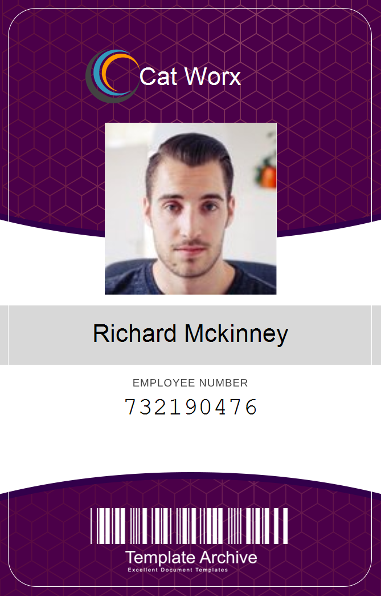

  # Catworx Badgemaker
  ## Table of Contents
  - [Description](#description)
  - [Installation Instructions](#installation-instructions)
  - [Usage Information](#usage-information)
  - [License](#license)
  - [Questions?](#questions)

  ## Description
  This is an application that creates employee badges for a fictional startup company called Catworx.
  
  The badgemaker is a command line app built using C# that allows for creation of employee badges, and it was built using a tutorial through Trilogy Education services. All random user data is provided via the [Random User Generator](https://randomuser.me/) API.

  ## Installation Instructions
  Download the repository from Github, and open the app folder in Visual Studio Code. Open up the terminal in VS Code and enter 'dotnet run' to begin the application.

  ## Usage Information
  Open the app in Visual Studio Code and enter 'dotnet run' in the terminal. You will be prompted to choose if you want to manually create an employee badge, or if you want to automatically create badges using API data from [Random User Generator](https://randomuser.me/). Upon entering data or selecting to generate badges automatically, all badges will be available as PNG files in the data folder.
  
  ## License

  This software is licensed under MIT License.

  The details for this license can be found [here](https://opensource.org/licenses/MIT).
      
 
  ## Questions?
  Find me on github at gleeson-emily.